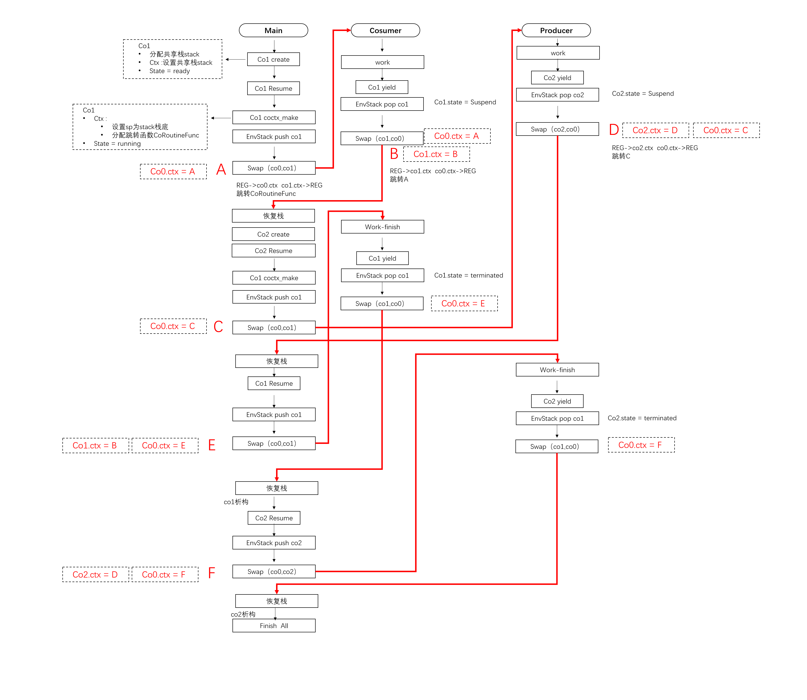

### 协程库（参考libco）  
___
协程库采用非对称协程的方式设计，使用共享栈的形式保存运行时栈数据，此模块主要可分为4个部分  
  1. coctx模块--现场保护与上下文切换  
  coctx_t作为上下文载体，用于保存当前运行时的重要寄存器状态，包括堆栈栈顶指针SP，栈底指针BP等，通过伪造返回地址，将sp指向指定好的下一条命令的运行地址，实现cpu的跳转，整个协程切换的根本来自以下操作，即coctx_swap.S汇编文件的工作内容：  
 ```
 	当前通用寄存器 -> currentCo->ctx  
 	pendingCo->ctx -> 当前通用寄存器
 ```
  2. CurrentThread -- 线程局部空间  
  提供该线程的协程环境、共享栈空间管理，当需要在当前线程创建协程的时候，提供协程环境和共享栈初始化、内存分配的功能
  3. ShareStack -- 位于堆的共享栈空间  
   一般协程可以设计为独立栈或共享栈，由于独立栈在线程数量大的情况过于耗费内存且浪费（128k），栈小又有溢出风险，因此选用共享栈，这也是一种时间换空间的做法  
     * StackMemory：内存空间封装，以智能指针来维护生命周期 
     * ShareStacks：管理分配所有内存空间的对象，作为线程局部变量为当前线程的协程服务  
  4. Coroutine -- 协程  
     * CoroutineEnv：线程唯一的协程环境，可理解为调度器，通过callStack_来实现非对称协程的调度，同时承担管理共享栈的责任，利用occupyCoroutine_和pendingCoroutine_保存协程换入换出时的共享栈状态  
     * Coroutine：协程对象，初始化时由线程分配共享栈内存，同时拥有临时空间指针来保存共享栈换出时的栈数据  

<br/>
<br/>

#### RAII  
___  
  关于RAII思想设计协程对象管理资源：对于底层swap等操作，测试发现智能指针会引起很多运行时错误，底层不适合使用智能指针来维护，同时会影响效率。  
  因此我认为应该在上层使用智能指针来管理协程，协程库这部分需要保证指针引用和state的同步即可，从设计层面避免野指针等内存泄漏等问题，以换取更好的时间消耗。
<br/>
<br/>

#### 双协程切换流程示意图  
___  
对应文件：netLibZ/core/testCoroutine/Consumer.cpp
  