## 协程库测试
___
* 性能测试工具：Benchmark
* 测试环境：
  * wsl+ubuntu:18.04  
  * AMD Ryzen 5 4600H 3.0GHz  
  * 测试文件：测试均使用裸指针、共享栈模式  
    * /netLibZ/core/testCoroutine/testCoroutine.cpp  
    * /netLibZ/core/testCoroutine/testLibco.cpp  
* 测试结果：  
  * 协程创建：暂不进行，原因见错误排查记录  
  * 协程切换：测试两个协程与主协程交替切换，1次为co1换入-co1换出-co2换入-co2换出的时间
    * NetLibZ：470ns/次，见/pic/协程创建/NetLibZ_switch.png  
    * Libco：109ns/次,见/pic/协程创建/Libco_switch.png  
	* 原因分析：1）NetLibZ使用面向对象的方式封装协程库，代码可读性增强的代价是栈上操作数变多
* 优化方向：1）参数拷贝，例如使用move降低参数复制的消耗；2）减少不必要的操作接口，以减小栈上调整操作的次数
 

## 错误排查记录
___
  在测试的时候碰到了很多问题，在此记录流程，排查问题能学到一些debug技巧，并且加深对操作系统的认识，还是很有意义的，尽管回头看这个问题其实非常简单，为愚蠢付出代价吧。  
* 协程创建性能测试：  
  1. 利用benchmark，分别测试netLibZ和Libco创建100 1000 30000个协程耗费时间，因为是参考libco开发的库，按理应该性能差不多，但是却发现如下问题：  
     * 释放内存_NetLibZ_benchMark：  
	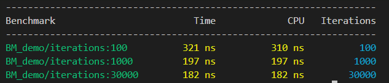  
     * 释放内存_libco_benchMark：  
	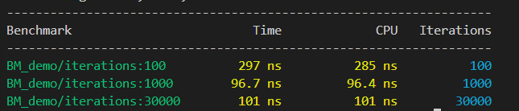  
     * 不释放内存_NetLibZ_benchMark：  
	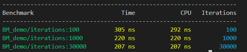   
     * 不释放内存_libco_benchMark：  
	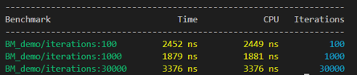   
	在释放内存的情况下，libco性能优于NetLibZ，猜测我使用function封装函数，并且stackMemory用sharedPtr管理，产生了一定的代价。  
	在不释放内存的情况下，libco特别慢，而NetLibZ表现正常。
  2. 猜想：benchmark多线程问题，然而benchmark多线程就算会malloc多个共享栈，但协程按照共享栈模式是不会malloc新的栈空间，为了严谨还是使用计时器测试了一下，结果没有变化，计时器测试截图见/pic/协程创建。  
  3. 从网络中搜集libco压力测试的信息，发现网络测试结果与我的测试结果一致，这意味着libco测试结果正确，此时问题变成了两个：1)为什么libco这么慢 2)为什么NetLibZ没有这部分耗时
  4. 猜想：可能是malloc耗时问题，于是使用pmap指令对执行结束的程序进行观察，结果如下：  
     * pmap_NetLibZ_100.png：  
	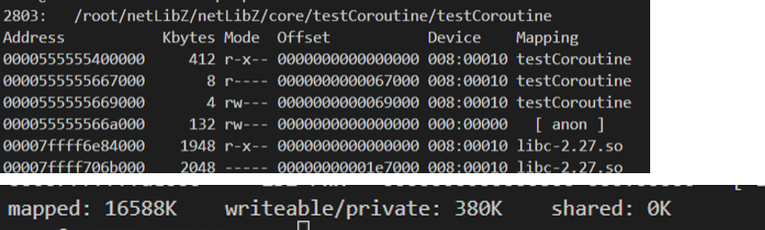  
     * pmap_NetLibZ_1000.png：  
	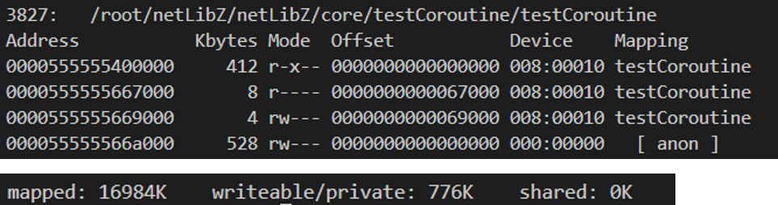  
	 * pmap_NetLibZ_30000.png：  
	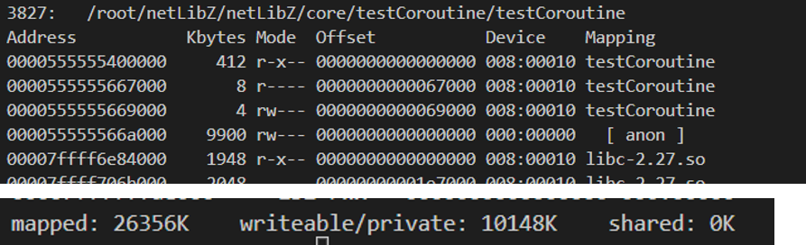  
     * pmap_Libco_100.png：  
	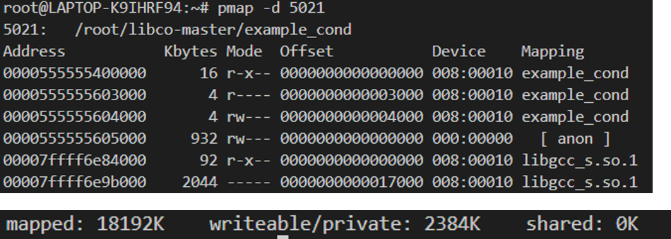  
	 * pmap_Libco_1000.png：  
	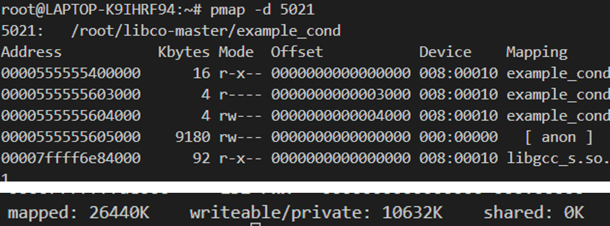  
	 * pmap_Libco_30000.png：  
	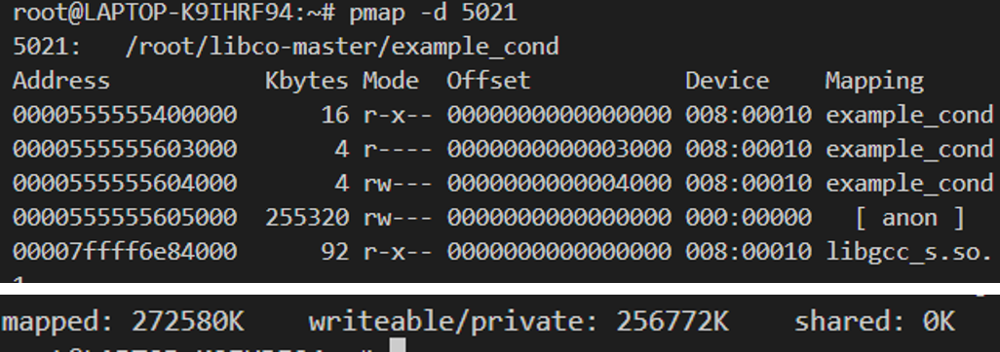  
	计算得到：NetLibZ一个协程占用≈0.3124kb，Libco一个协程占用≈8.248kb  
  5. 验证4：gdb中使用call malloc_stats()对一个协程的malloc进行单步验证，结果如下：
  	  * gdb_Libco_3000_单步1.png：  
	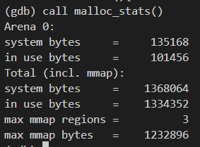   
	  * gdb_Libco_3000_单步2.png：  
	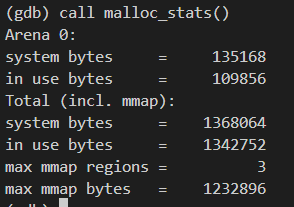   
	显然，一个协程创建前后堆使用空间增长了8.4kb，的确是内存分配导致的耗时，接下来去源码分析耗时所在。  
  6. 分析源码：  
	一开始仅仅分析所有可能malloc的地方，一无所获，最后发现libco的协程实体stCoRoutine_t有一个大小为128的指针数组stCoSpec_t aSpec[1024]，这里多了8k的空间，瞬间恍然大悟，这真是一个愚蠢的问题。  
  7. 结论：libco拥有一个指针数组aSpec用于存储协程的数据，导致单个协程空间为8k，大量协程创建的时候malloc耗时巨大。而aSpec的作用暂时不清楚，因此协程创建的性能测试暂时无意义。

 

## 未解决问题
___
1. 当libo未协程melloc申请内存到一定程度后，位于共享库的内存映射区域中，ld-2.27.so申请了一块空间，不知道是为什么
   * ld-2.27so.png：  
	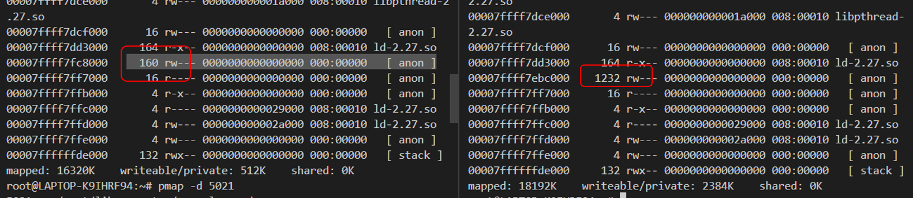   